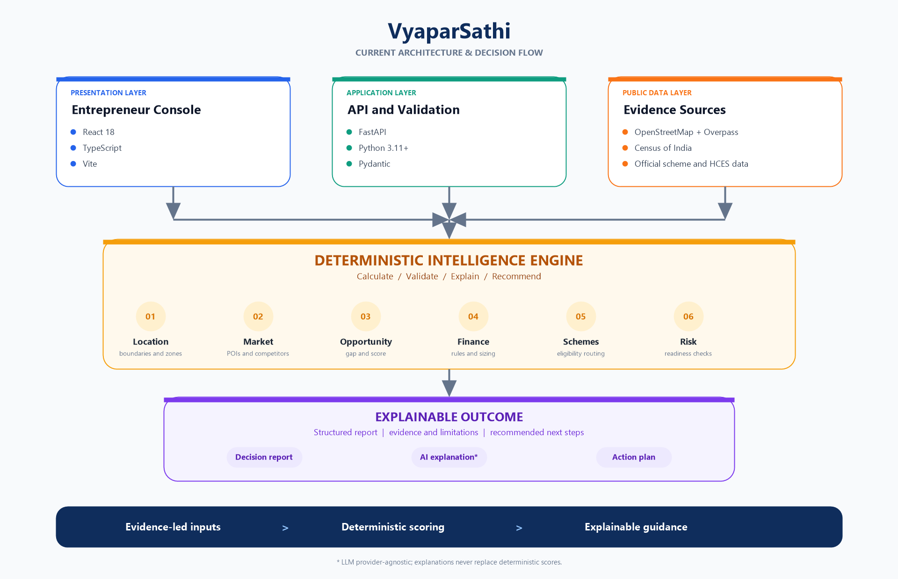
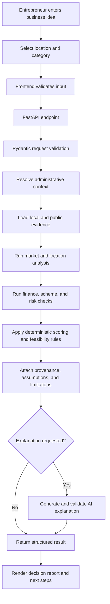
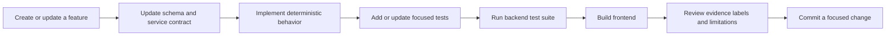

# VyaparSathi

## Evidence-led business planning for India's local entrepreneurs

VyaparSathi is a modular monolith with a React/Vite frontend and FastAPI backend. It is a decision-support platform for evaluating rural and local enterprise ideas, bringing location intelligence, market signals, financial modelling, government schemes, and risk checks into one explainable workflow so an entrepreneur can move from **“Is this viable here?”** to a practical next step.



> **Evidence-led inputs → deterministic scoring → explainable guidance**

## Why VyaparSathi

Small-business decisions are often made with fragmented data, informal estimates, and unclear financing assumptions. VyaparSathi makes the reasoning visible:

- **Local context:** understand the administrative area, population and household evidence around a proposed location.
- **Market reality:** inspect nearby businesses and points of interest using public-data and configured provider fallbacks.
- **Financial clarity:** model project cost, margins, working capital, repayment, break-even, and multiple scenarios.
- **Actionable guidance:** surface feasibility flags, relevant scheme routes, risks, limitations, and recommended next steps.

The platform is deliberately conservative. Every value is labelled `CALCULATED`, `ESTIMATED`, `ASSUMPTION`, or `UNKNOWN`; missing evidence is disclosed rather than invented.

## Product capabilities

### Local Area Intelligence

State → District → Sub-district Census 2011 lookup, population and household evidence, affordability positioning, competitor/provider discovery, optional OpenRouteService travel time, SWOT signals, and report-ready location analysis.

### Financial Intelligence

Deterministic project-cost, revenue, margin, working-capital, EMI, repayment-coverage, and break-even calculations, with conservative, base, and optimistic scenarios. Decimal-safe calculations support transparent financing recommendations.

### Explainable decision reports

The output keeps evidence, assumptions, confidence, limitations, and recommendations together. AI explanations are provider-agnostic and do not replace the deterministic scores.

## Architecture

VyaparSathi is a modular monolith. The browser owns the entrepreneur workflow, while FastAPI owns validation, evidence access, calculations, and response contracts.

| Layer | Technology | Responsibility |
| --- | --- | --- |
| Presentation | React, TypeScript, Vite | Entrepreneur console and decision workflow |
| Application | FastAPI, Python 3.11+, Pydantic | Validation, domain APIs, and orchestration |
| Intelligence | Python services | Location, market, finance, scheme, and risk analysis |
| Evidence | Census of India, OpenStreetMap/Overpass, HCES, public scheme data | Traceable public and configured provider inputs |

## End-to-end process flow

The main decision journey follows the same evidence-first sequence for every assessment:



### What happens at each stage

1. **Capture intent:** the user chooses an enterprise category, location, radius, and financial assumptions in the React console.
2. **Validate the request:** the frontend sends JSON to a focused FastAPI route; Pydantic schemas reject invalid or incomplete payloads.
3. **Resolve context:** location services identify the State, District, sub-district, boundaries, and available geographic scope.
4. **Gather evidence:** services read seeded datasets and local Census data, then use configured public providers such as OpenStreetMap/Overpass, Google, Mappls, or OpenRouteService where available.
5. **Calculate intelligence:** market, competition, opportunity, financial, scheme, and risk logic produces structured outputs. Calculations remain deterministic and reproducible.
6. **Qualify the result:** values receive evidence labels, source context, assumptions, limitations, and feasibility flags. Unsupported precision stays `UNKNOWN`.
7. **Explain and present:** the optional AI layer explains the structured result; it cannot replace deterministic calculations. The frontend renders the report, evidence, warnings, and recommended actions.

## Data and intelligence flow

```text
Public sources and seed files
	↓
Ingestion and normalization scripts
	↓
Validated local data and database records
	↓
API route and Pydantic schema
	↓
Domain service / intelligence engine
	↓
Deterministic calculation and scoring
	↓
Provenance, assumptions, limitations, and confidence
	↓
Structured API response
	↓
React report, explanation, and action plan
```

The system is designed to disclose uncertainty rather than manufacture a complete-looking answer. A sub-district total, for example, is not silently converted into an exact 5 km or 10 km population estimate without appropriate village or grid geometry.

## Quick start

### 1. Start the backend

```bash
cd backend
python3 -m pip install -r requirements.txt
python3 -m uvicorn app.main:app --reload
```

### 2. Start the frontend

In a second terminal:

```bash
cd frontend
npm install
npm run dev
```

Open [http://127.0.0.1:5173](http://127.0.0.1:5173).

## Configuration and data

Copy `backend/.env.example` to `backend/.env` and configure provider credentials locally. Never commit `.env` or API keys.

The supplied Census 2011 PCA workbook is imported into `backend/data/census_2011.sqlite` for fast local reads. The generated database is intentionally ignored by Git. Google Geocoding and Places API access is optional; OpenRouteService provides a geocoding and routing fallback when configured.

Exact 5 km and 10 km population figures remain `UNKNOWN` unless village or grid population geometry is available. A sub-district total cannot accurately be converted into a radius population.

## API surface

- `POST /api/market/local-demographics`
- `POST /api/market/analyze`
- `POST /api/market/competitor-map`
- `POST /api/finance/analyze`
- `POST /api/finance/roadmap`
- `POST /api/schemes/route`
- `GET /health`

## Repository structure

```text
VyaparSathi/
├── backend/
│   ├── app/
│   │   ├── api/       FastAPI route modules for market, finance, location, risk, schemes, and assistant features
│   │   ├── core/      Configuration, database, constants, and shared application concerns
│   │   ├── models/    Persistence models and domain entities
│   │   ├── schemas/   Pydantic request and response contracts
│   │   ├── services/  Intelligence, calculation, lookup, and report services
│   │   └── utils/     Geography, normalization, provenance, and shared helpers
│   ├── data/          Seed JSON files and generated local data assets
│   ├── scripts/       Data ingestion, indexing, verification, and intelligence utilities
│   ├── tests/         API, finance, market, geography, ingestion, and contract tests
│   ├── alembic/       Database migration configuration and revisions
│   ├── requirements.txt
│   └── .env.example
├── frontend/
│   └── src/           React screens, API client, types, finance helpers, and styles
├── data/              Shared public-data inputs and indexes
├── docs/              API, finance, market, scoring, data-source, and architecture notes
├── assets/            Architecture diagrams and project visuals
├── output/            Generated reports and PDF output
├── scripts/           Repository-level report and automation scripts
└── README.md
```

### Where to make a change

| Change | Start here |
| --- | --- |
| Add or change an HTTP endpoint | `backend/app/api/` and the matching `backend/app/schemas/` contract |
| Change business calculations | The owning service under `backend/app/services/`; cover it in `backend/tests/` |
| Add a data source or importer | `backend/scripts/`, `backend/data/`, and the relevant provenance or model code |
| Change the user workflow | `frontend/src/App.tsx`, `frontend/src/api.ts`, and `frontend/src/types.ts` |
| Change visual presentation | `frontend/src/styles.css` or the relevant frontend stylesheet |
| Explain a domain rule | The matching document under `docs/` and, where applicable, an executable test |

## Development flow



Keep changes focused by layer. A new calculation should have a service-level test and an API contract test when it changes a response. A new provider should preserve a usable fallback and clearly report unavailable or cached evidence.

## Verification

```bash
cd backend && pytest -q
cd frontend && npm run build
```

## Project status

VyaparSathi is an actively developed decision-support prototype. Provider availability, local datasets, and evidence scope can affect results; the product presents those boundaries explicitly so recommendations remain useful and honest.
