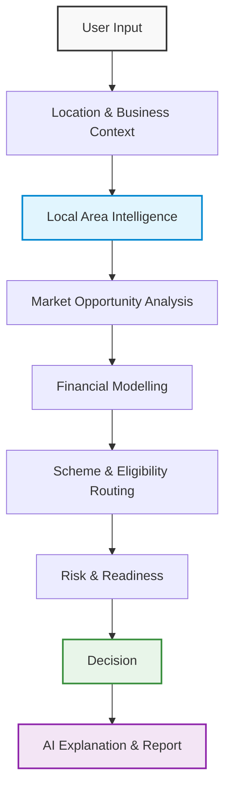

# GramVyapar

**AI-powered business feasibility and smart financing assistant for rural entrepreneurs.**

GramVyapar is a data-driven decision-support platform designed to help rural and semi-urban entrepreneurs evaluate business opportunities, understand local market dynamics, and make evidence-backed financial decisions.


---

## 2. Problem

Rural and semi-urban first-time entrepreneurs often choose businesses based on assumptions, anecdotal knowledge, or seeing what neighbors are doing. They frequently lack:

* Hyper-local market intelligence
* Competitor visibility and business density
* True understanding of local demand limits
* Structured business planning support
* Accurate financial modelling knowledge
* Understanding of suitable government financing schemes

Operating on assumptions leads to poor business selection, unrealistic project sizing, over-borrowing, and ultimately, a high risk of repayment failure.

---

## 3. Solution

GramVyapar acts as a sophisticated decision-support platform. It replaces assumptions with data, evaluating businesses through a modular intelligence pipeline that includes:

* Hyper-local market intelligence
* Demographic analysis
* Nearby POI (Points of Interest) intelligence
* Existing business mapping
* Competition analysis
* Demand and distribution signals
* Seasonality
* Purchasing-power indicators
* Deterministic financial modelling
* Government scheme routing
* Risk analysis and readiness assessment
* AI-powered explanations

GramVyapar strictly follows a robust operational philosophy:
**Calculate → Validate → Explain → Recommend**

---

## 4. How It Works

GramVyapar processes decisions through a deterministic pipeline before interpreting them with AI.



---

## 5. Local Area Intelligence

The Local Area Intelligence Engine is the core capability of GramVyapar. It dynamically evaluates a selected business against its immediate and extended geographic market.

### Geographic Market Zones
* **0–2 km** — Immediate Local Market
* **2–5 km** — Primary Market
* **5–10 km** — Extended Market

### Location Intelligence
The system anchors analysis based on:
* Country, State, District, Block/Subdistrict, and Village/Town
* Exact Coordinates and Geographic Radius

### Demographic Intelligence
Market analysis utilizes available demographic indicators:
* Population and Households
* Gender distribution and Age groups
* Literacy and Working population
* Other available official indicators

### Nearby POIs
The engine aggregates points of interest to assess infrastructure and ambient demand:
* Schools and Colleges
* Hospitals/clinics
* Religious places
* Railway stations and Bus stands
* Markets, Banks, Government offices
* Industrial, Residential, and Tourist locations

### Existing Business Intelligence
GramVyapar maps businesses to evaluate:
* Competition density and Market activity
* Complementary demand and Nearby commercial activity

*(Note: GramVyapar maps registered or known businesses; this does not claim to represent every informal or unregistered real-world entity.)*

---

## 6. Context-Aware Business Intelligence

Businesses are not treated as competitors universally. The same business plays different roles depending on the proposed venture.

For example, if analyzing a **Hotel**:
* **Hotel → Hotel:** Competitor
* **Hotel → Restaurant:** Potential demand generator / complementary business
* **Hotel → Laundry:** Potential demand generator
* **Hotel → Taxi:** Potential demand generator

**One generic intelligence engine, many configurable business categories.** 
GramVyapar uses configurable category definitions instead of hardcoding separate engines for every business type.

---

## 7. Market Opportunity Analysis

The platform deterministically evaluates market feasibility using configurable weights, outputting structured scores for:

* Demand
* Competition
* Opportunity gap
* Business activity
* Distribution
* Seasonality
* Purchasing power
* Demographic fit
* Accessibility

This results in a **Market Gap Score** and a **Market Opportunity Score**. These are calculated mathematically—AI is never used to generate or "guess" these scores.

---

## 8. Data Philosophy

GramVyapar is built on a foundation of data integrity.

### Public-Data First
We prioritize reliable, open, and legitimately accessible data sources.

### No Fake Precision
If reliable data is unavailable, the system does not fabricate numbers. Information is tagged with its provenance and confidence level:
* `VERIFIED`
* `CALCULATED`
* `ESTIMATED`
* `SEEDED_DEMO`
* `ASSUMPTION`
* `AI_INTERPRETATION`

Every meaningful piece of external data preserves provenance:
* Source ID / Name
* Source URL
* Verification Date
* Confidence (`HIGH`, `MEDIUM`, `LOW`, `UNKNOWN`)

---

## 9. AI Philosophy

**AI explains the decision; it does not invent the decision.**

AI is **not the source of truth** in GramVyapar. 
Deterministic backend logic calculates all financial values, scheme rules, eligibility logic, scores, and decision inputs.

AI is strictly relegated to:
* Explanation and Summarization
* Translation and Human-friendly interpretation
* SWOT wording
* Risk explanations
* Action-plan generation

In the absence of an AI connection, the system gracefully falls back to structured numerical reports.

---

## 10. Architecture

GramVyapar is structured as a **Modular Monolith**.

```text
Frontend
   ↓
FastAPI Backend
   ↓
Business Intelligence & Decision Engines
   ↓
PostgreSQL
   ↓
Government / Open Data / Legitimate Data Sources
```

Major modular domains include:
* **Location**
* **Market**
* **Opportunity**
* **Finance**
* **Schemes**
* **Risk & Readiness**
* **Assessment & Decision**
* **AI & Reports**

---

## 11. Technology Stack

### Backend
* **Python 3.11+**
* **FastAPI**
* **Pydantic**

### AI
* Integrations via modular Prompt Builders and Validators (LLM Provider agnostic)

### Testing
* **Pytest**

*(Note: Frontend and Database stacks are pending integration).*

---

## 12. Current Implementation

### Implemented
* Backend architecture and scaffolding
* Local Area Intelligence Engine
* Location intelligence and Geographic market zones
* Demographic intelligence
* POI analysis and Existing business intelligence
* Competition analysis (with bounded distance decay)
* Demand signals, Distribution signals, Seasonality
* Purchasing-power signals (gracefully falling back when data is missing)
* Market opportunity analysis (Gap scoring)
* Opportunity Ranking, Scoring, and Validation Engines
* AI Explanation Layer (Prompt building, validation, fallback)
* Report Generation (Templates)
* Provenance and confidence handling
* Automated tests suite

### Planned / Next Modules
* Financial Engine
* Scheme Router
* Risk Engine
* Readiness Engine
* Decision Engine
* Production Database (PostgreSQL)

---

## 13. Project Structure

```text
GramVyapar/
├── backend/
│   ├── app/
│   │   ├── api/
│   │   ├── core/
│   │   ├── models/
│   │   ├── schemas/
│   │   ├── services/
│   │   └── utils/
│   ├── data/
│   ├── scripts/
│   ├── tests/
│   └── requirements.txt
├── backend_structure.md
└── README.md
```

---

## 14. Getting Started

### Backend Setup

1. **Clone the repository and enter the backend directory**
   ```bash
   git clone https://github.com/Iankitsinghak/VyaparSathi.git
   cd VyaparSathi/backend
   ```

2. **Create and activate a virtual environment**
   ```bash
   python3 -m venv venv
   source venv/bin/activate  # On Windows use `venv\Scripts\activate`
   ```

3. **Install dependencies**
   ```bash
   pip install -r requirements.txt
   ```

4. **Run the FastAPI server**
   ```bash
   uvicorn app.main:app --reload
   ```
   The API will be available at `http://127.0.0.1:8000`.

---

## 15. Testing

GramVyapar ensures deterministic calculations remain accurate through automated testing. Areas covered include:
* Geographic boundaries and distance decay (`test_geo.py`)
* Market and competition calculations (`test_market.py`, `test_competition.py`)
* Opportunity scoring and AI validation fallbacks

Run the test suite using:
```bash
cd backend
PYTHONPATH=. pytest tests/
```

---

## 16. Design Principles

* **Deterministic First:** Critical calculations are deterministic, never generated by an LLM.
* **Evidence Driven:** Recommendations are strictly grounded in available data.
* **No Fabricated Data:** Unavailable information is handled gracefully, never faked.
* **Explainable:** Users must be able to understand *why* a recommendation was made.
* **Configurable:** Business intelligence scales across categories through dynamic configuration.
* **Modular:** The system is organized as a maintainable modular monolith.
* **Extensible:** New business categories, datasets, and schemes can be added without rewriting core engines.

---

## 17. Roadmap

* [x] Backend foundation
* [x] Local Area Intelligence
* [x] Opportunity Ranking & Scoring
* [x] AI Explanation Layer & Validators
* [x] Report Generation Engine
* [ ] Financial Intelligence
* [ ] Government Scheme Router
* [ ] Risk & Readiness
* [ ] Decision Engine
* [ ] Production Data Pipeline
* [ ] Multilingual Experience
* [ ] Deployment & Monitoring

---

## 18. SIH / Impact Positioning

GramVyapar directly addresses the information asymmetry faced by rural entrepreneurs. By providing better local market intelligence and financial understanding, the platform encourages:
* Better business selection based on true geographic demand.
* Responsible use of AI for rural economic empowerment.
* Improved financial sizing to match market reality, reducing loan default risk.
* More informed, evidence-backed entrepreneurial decisions.

---

## 19. Disclaimer

**GramVyapar provides decision-support and estimates based on available data.** It does not guarantee business success, revenue, loan approval, or financial outcomes. Government scheme eligibility and final lending decisions remain subject to the relevant authority/lender and applicable rules.

---

## 20. Contribution

We welcome contributions! To contribute:
1. **Fork** the repository.
2. Create a new **Branch** for your feature or bugfix.
3. Make your **Changes**.
4. Write and run **Tests** to ensure determinism is not broken.
5. Submit a **Pull Request**.

---

## 21. License

*(License pending/TBD)*
